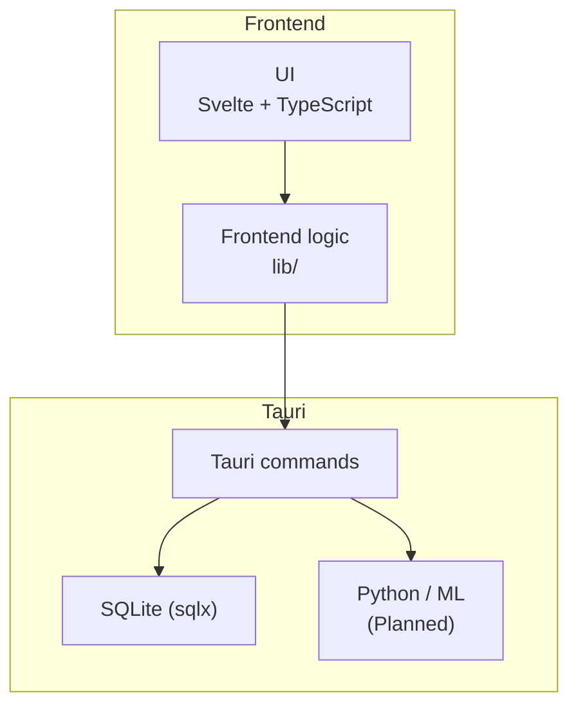
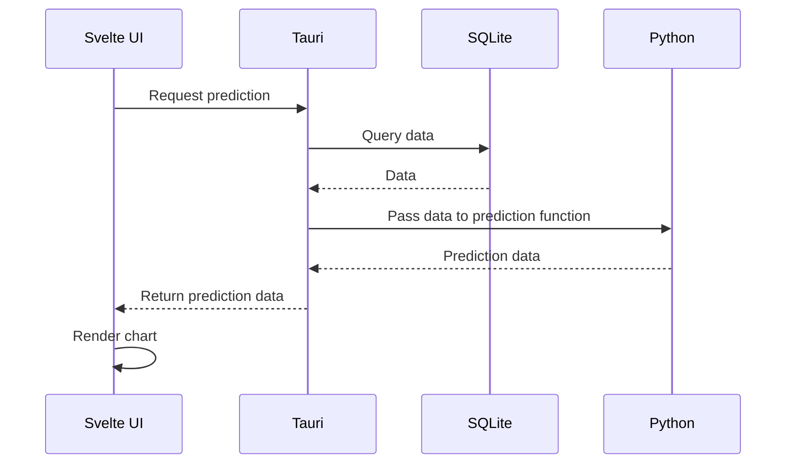

# FinRadar
[](https://opensource.org/licenses/MIT)

FinRadar is a local desktop application combining finance tracking, data visualization, notes, calendar and alerts. It is built with Svelte and Typescript on the frontend and Tauri/Rust for the application logic.<br/>
It is a continuation of my previous projects, where it combines them, the [Finance Tracker](https://github.com/Stenberg-N/finance-tracker) and the [FocusBoard](https://github.com/Stenberg-N/focusboard), into a single coherent app where I apply all the lessons learned.
It is built for my own needs much like the previous projects and it will continue to get more features if and when I have a need for something.

## Architecture

FinRadar uses a Svelte + TypeScript frontend with Tauri/Rust handling application logic and SQLite for persistence. Shared frontend modules (lib/) communicate with Tauri commands. Python-based ML functionality is planned for forecasting finances.

### Planned ML prediction flow


## Installation
### App installer
Currently, there is no installer available.

### Manual
#### Requirements
1. Rust. You can install it [here](https://rust-lang.org/tools/install/)
2. Microsoft Visual Studio C++ Build Tools, found [here](https://visualstudio.microsoft.com/visual-cpp-build-tools/)
3. Node.js for the dev environment, found [here](https://nodejs.org)

#### Next steps
##### Clone the repository
```sh
git clone https://github.com/Stenberg-N/fin-radar.git
```
```sh
cd fin-radar
```
##### Install the dependencies
```sh
npm install
```
##### Run the dev environment
```sh
npm run tauri dev
```
##### Alternatively, to build the app
```sh
npm run tauri build
```

## Other
The app saves its database and logs inside your user's local app data:<br>
C:\Users\Your_username\AppData\Local\com.stenberg.fin-radar

The app saves other data to the user's roaming app data, e.g. preferences and other settings set by the user:<br>
C:\Users\Your_username\AppData\Roaming\com.stenberg.fin-radar

## Screenshots


## Acknowledgements
This app uses icons for its UI from Uicons by <a href="https://www.flaticon.com/uicons">Flaticon</a>

## License
This project is licensed under the MIT license. See the LICENSE file for details.
